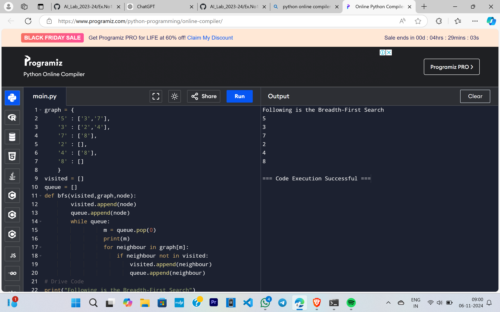

# Ex.No: 1  Implementation of Breadth First Search 
### DATE:                                                                            
### REGISTER NUMBER : 
### AIM: 
To write a python program to implement Breadth first Search. 
### Algorithm:
1. Start the program
2. Create the graph by using adjacency list representation
3. Define a function bfs and take the set “visited” is empty and “queue” is empty
4. Search start with initial node and add the node to visited and queue.
5. For each neighbor node, check node is not in visited then add node to visited and queue list.
6.  Creating loop to print the visited node.
7.   Call the bfs function by passing arguments visited, graph and starting node.
8.   Stop the program.
### Program:

### Output:

### Result:
Thus the breadth first search order was found sucessfully.
